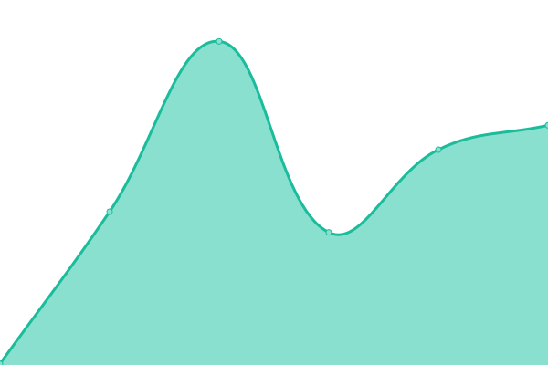

# [📈 Live Status](https://demo.upptime.js.org): <!--live status--> **🟧 Partial outage**

This repository contains the open-source uptime monitor and status page for [Upptime](https://upptime.js.org), powered by [Upptime](https://github.com/upptime/upptime).

With [Upptime](https://upptime.js.org), you can get your own unlimited and free uptime monitor and status page, powered entirely by a GitHub repository. We use [Issues](https://github.com/upptime/upptime/issues) as incident reports, [Actions](https://github.com/upptime/upptime/actions) as uptime monitors, and [Pages](https://demo.upptime.js.org) for the status page.

<!--start: status pages-->
<!-- This summary is generated by Upptime (https://github.com/upptime/upptime) -->
<!-- Do not edit this manually, your changes will be overwritten -->
<!-- prettier-ignore -->
| URL | Status | History | Response Time | Uptime |
| --- | ------ | ------- | ------------- | ------ |
|  [mmrma](https://mmrma.org/) | 🟩 Up | [mmrma.yml](https://github.com/GrattaWebDesignStudio/upptime/commits/HEAD/history/mmrma.yml) | 

 164ms
     
 | 

<a href="https://demo.upptime.js.org/history/mmrma">100.00%</a>
    

|  [boundaryelectric](https://www.boundaryelectric.com/) | 🟩 Up | [boundaryelectric.yml](https://github.com/GrattaWebDesignStudio/upptime/commits/HEAD/history/boundaryelectric.yml) | 

 377ms
     
 | 

<a href="https://demo.upptime.js.org/history/boundaryelectric">100.00%</a>
    

|  [ethicsinsight](https://ethicsinsight.co/) | 🟩 Up | [ethicsinsight.yml](https://github.com/GrattaWebDesignStudio/upptime/commits/HEAD/history/ethicsinsight.yml) | 

 2418ms
     
 | 

<a href="https://demo.upptime.js.org/history/ethicsinsight">100.00%</a>
    

|  [vanyoo](https://www.vanyoo.com/) | 🟥 Down | [vanyoo.yml](https://github.com/GrattaWebDesignStudio/upptime/commits/HEAD/history/vanyoo.yml) | 

 138ms
     
 | 

<a href="https://demo.upptime.js.org/history/vanyoo">0.07%</a>
    

|  [micheauxfilmfest](https://micheauxfilmfest.com/) | 🟩 Up | [micheauxfilmfest.yml](https://github.com/GrattaWebDesignStudio/upptime/commits/HEAD/history/micheauxfilmfest.yml) | 

 126ms
     
 | 

<a href="https://demo.upptime.js.org/history/micheauxfilmfest">100.00%</a>
    

<!--end: status pages-->

[**Visit our status website →**](https://demo.upptime.js.org)

## 📄 License

- Powered by: [Upptime](https://github.com/upptime/upptime)
- Code: [MIT](./LICENSE) © [Anand Chowdhary](https://anandchowdhary.com), supported by [Pabio](https://pabio.com)
- Data in the `./history` directory: [Open Database License](https://opendatacommons.org/licenses/odbl/1-0/)
