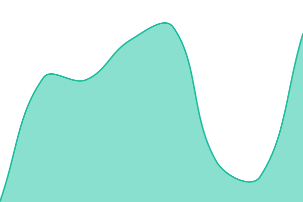
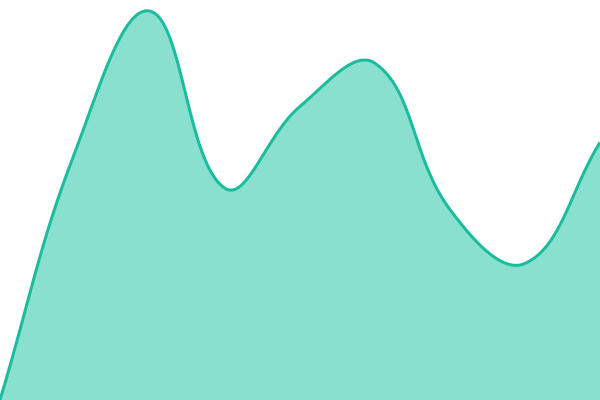

<!--start: status pages-->
<!-- This summary is generated by Upptime (https://github.com/upptime/upptime) -->
<!-- Do not edit this manually, your changes will be overwritten -->
<!-- prettier-ignore -->
| URL | Status | History | Response Time | Uptime |
| --- | ------ | ------- | ------------- | ------ |
|  [mmrma](https://mmrma.org/) | 🟩 Up | [mmrma.yml](https://github.com/GrattaWebDesignStudio/upptime/commits/HEAD/history/mmrma.yml) | 

 6960ms
     
 | 

<a href="https://GrattaWebDesignStudio.github.io/upptime/history/mmrma">98.87%</a>
    

|  [tillerfoundation.org](https://tillerfoundation.org/) | 🟩 Up | [tillerfoundation-org.yml](https://github.com/GrattaWebDesignStudio/upptime/commits/HEAD/history/tillerfoundation-org.yml) | 

 573ms
     
 | 

<a href="https://GrattaWebDesignStudio.github.io/upptime/history/tillerfoundation-org">100.00%</a>
    

|  [ethicsinsight](https://ethicsinsight.co/) | 🟩 Up | [ethicsinsight.yml](https://github.com/GrattaWebDesignStudio/upptime/commits/HEAD/history/ethicsinsight.yml) | 

 3172ms
     
 | 

<a href="https://GrattaWebDesignStudio.github.io/upptime/history/ethicsinsight">98.85%</a>
    

|  [vanyoo](https://www.vanyoo.com/) | 🟩 Up | [vanyoo.yml](https://github.com/GrattaWebDesignStudio/upptime/commits/HEAD/history/vanyoo.yml) | 

 3128ms
     
 | 

<a href="https://GrattaWebDesignStudio.github.io/upptime/history/vanyoo">100.00%</a>
    

<!--end: status pages-->

[**Visit our status website →**](https://grattawebdesignstudio.github.io/upptime/)
